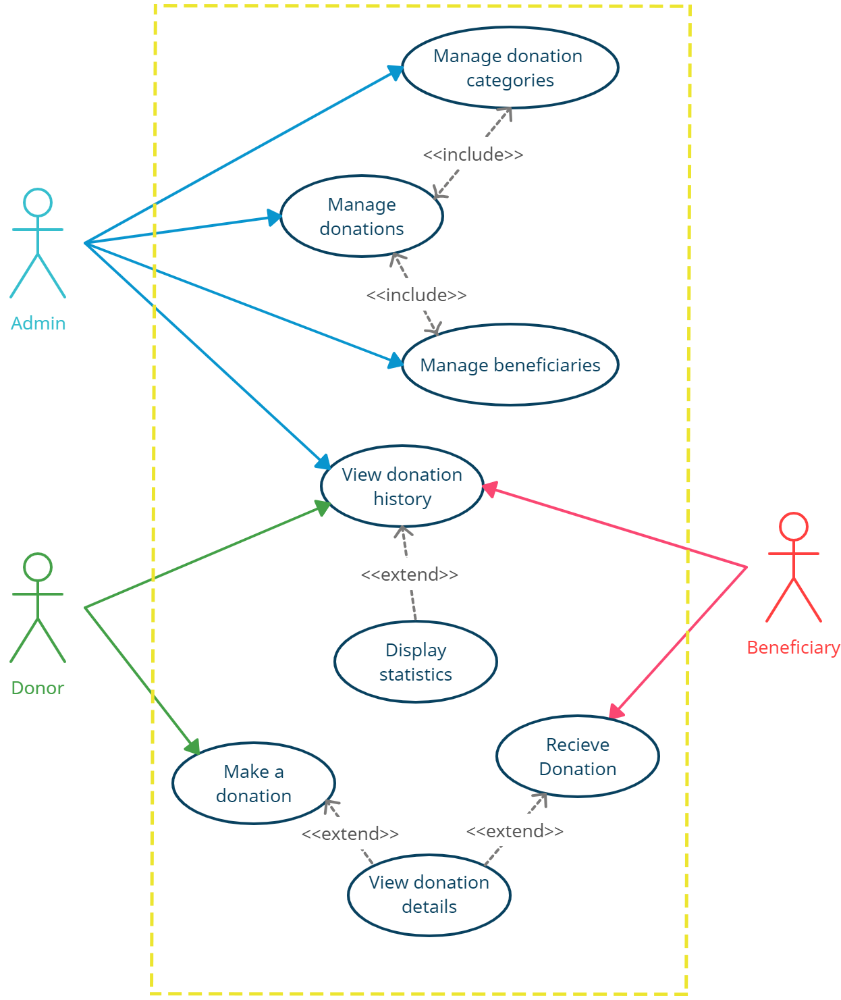
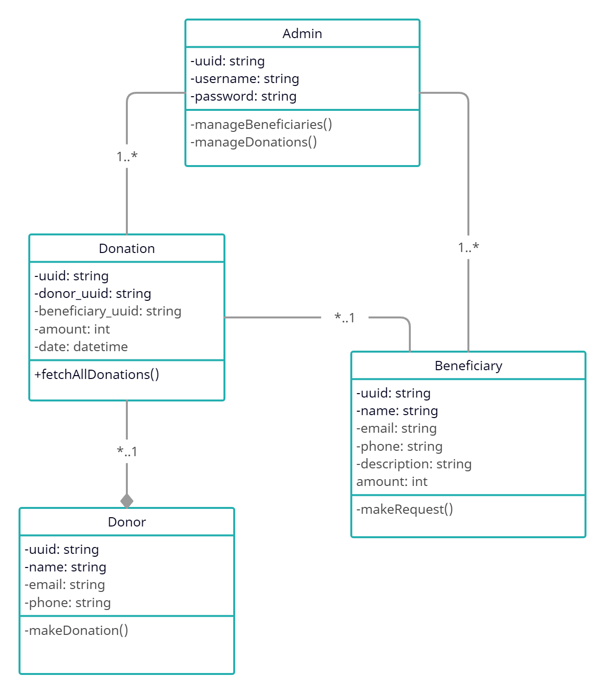
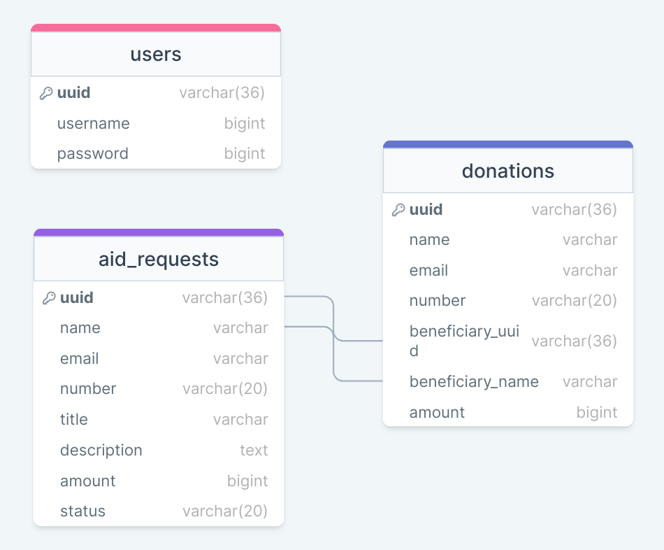

[](https://github.com/Iskenderun-Technical-University/mustafazeydani-YMG)

# GiveHope
GiveHope is a web-based application built with React.js, Node.js, and Express.js for managing donations.

GiveHope is a donation management system that serves as a platform for managing donations between donors, beneficiaries, and administrators. The system provides an easy-to-use interface that allows donors to make donations and track their donation history. Beneficiaries can use the system to create and manage their profiles, as well as to request and receive donations. Administrators can manage donation requests, approve and reject beneficiaries, and ensure that donations are distributed efficiently. The goal of the donation management system is to simplify the process of donating to those in need, while providing a secure and transparent platform for managing donations. By facilitating communication and coordination between donors, beneficiaries, and administrators, the system aims to improve the efficiency and effectiveness of the donation process, ultimately helping to make a positive impact on people's lives.

## Use Case


## Class Diagram


## Database Scheme


## Database Configuration
This application uses MySQL and  an .env file to store the database configuration information to ensure security. Before running the application, make sure to configure your own database by following these steps:

1- Ensure that you have a database set up and running, and that you have the necessary permissions to create and modify tables.

2- Navigate to the **server** directory `cd server`. You will find two files, **createTables.sql** and **.env-template**. 

2- Use the **createTables.sql** file to create the tables in your database.

3- Rename the **.env-template** file to **.env** and update it with your MySQL database configuration details.

Here's an example of the **.env** file:

```bash
host=localhost
user=root
password=password
database=my_database
port=3306
```

## Requirements
Before running the application, you need to have Node.js and npm installed on your system. You can download the latest version of Node.js from the [**offical website**](https://nodejs.org/).

## Installation
To install the application, follow these steps:

1- Clone the repository: 

```bash
git clone https://github.com/Iskenderun-Technical-University/mustafazeydani-YMG.git
```

2- Install the dependencies:

```bash
cd mustafazeydani-YMG/client
npm install
cd ../server
npm install
```

## Usage
To run the application, follow these steps:

1- Start the server:

```bash
cd server
npm start
```

This will start the server on **http[]()://localhost:8800**.

2- Start the client:

```bash
cd client
npm start
```

This will start the client on **http[]()://localhost:3000**.

3- Open **http[]()://localhost:3000** in your web browser to access the application.

## Feedback

If you have any feedback, please reach out to me at mustafamari20@gmail.com.