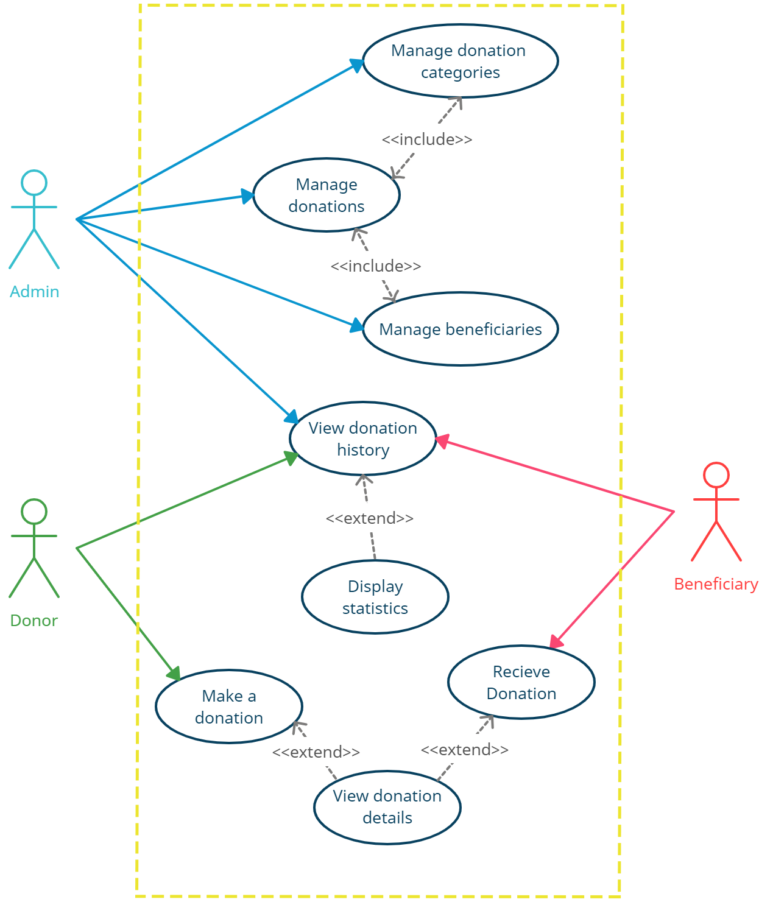
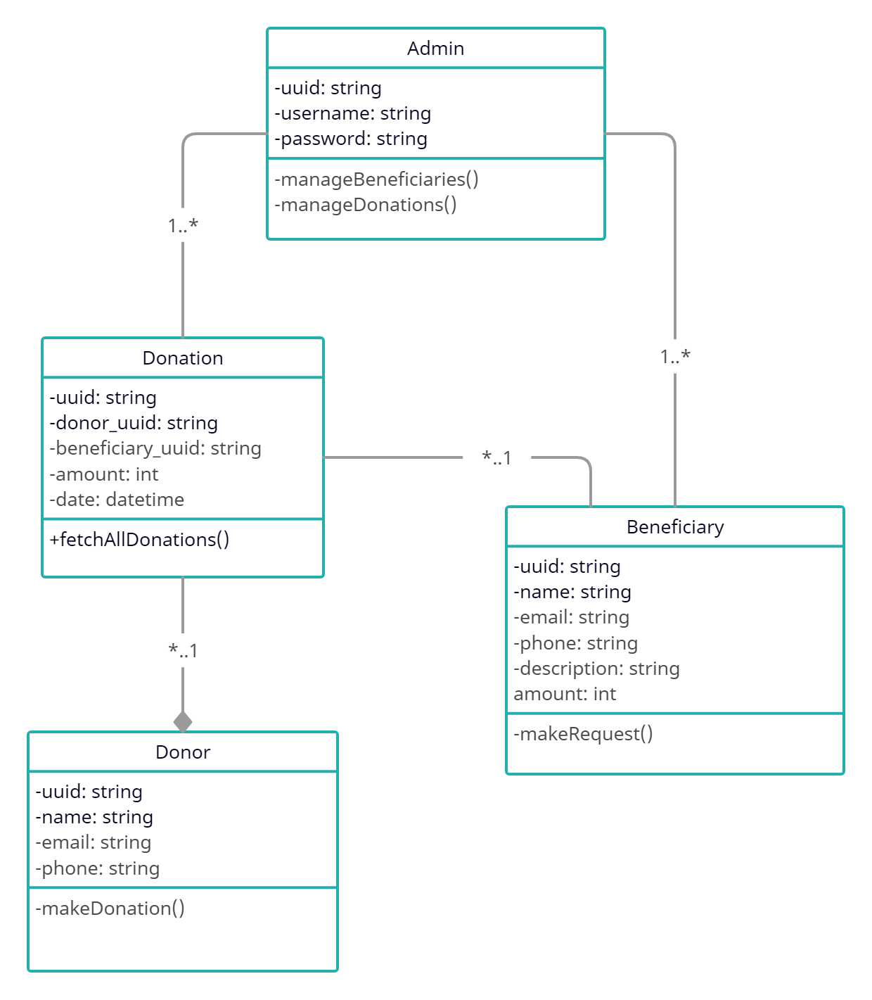
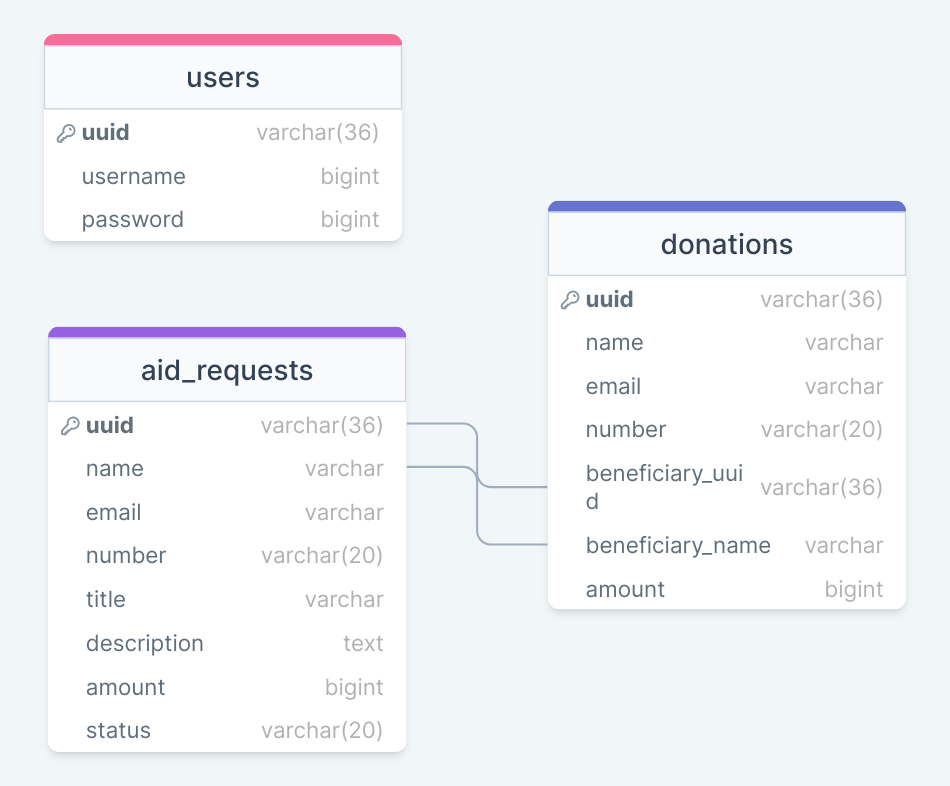

[](https://github.com/Iskenderun-Technical-University/mustafazeydani-YMG/blob/main/README-EN.md)

# GiveHope
GiveHope, bağışları yönetmek için React.js, Node.js ve Express.js ile oluşturulmuş web tabanlı bir uygulamadır.

GiveHope, bağışçılar, yararlanıcılar ve yöneticiler arasındaki bağışları yönetmek için bir platform görevi gören bir bağış yönetim sistemidir. Sistem, bağışçıların bağış yapmalarını ve bağış geçmişlerini takip etmelerini sağlayan kullanımı kolay bir arayüz sunar. Yararlanıcılar sistemi profillerini oluşturmak ve yönetmek, ayrıca bağış talep etmek ve almak için kullanabilirler. Yöneticiler bağış taleplerini yönetebilir, yararlanıcıları onaylayabilir ve reddedebilir ve bağışların verimli bir şekilde dağıtılmasını sağlayabilir. Bağış yönetim sisteminin amacı, bağışları yönetmek için güvenli ve şeffaf bir platform sağlarken, ihtiyaç sahiplerine bağış yapma sürecini basitleştirmektir. Sistem bağışçılar, yararlanıcılar ve yöneticiler arasındaki iletişim ve koordinasyonu kolaylaştırarak bağış sürecinin verimliliğini ve etkinliğini artırmayı ve nihayetinde insanların yaşamları üzerinde olumlu bir etki yaratmaya yardımcı olmayı amaçlamaktadır.

## Use Case


## Class Diagram


## Veritabanı Şeması


## Veritabanı Yapılandırması
Bu uygulama, MySQL veritabanı ve veritabanı yapılandırma bilgilerini saklamak ve güvenliği sağlamak için bir .env dosyası kullanmaktadır. Uygulamayı çalıştırmadan önce, kendi veritabanınızı konfigüre ettiğinizden emin olmak için aşağıdaki adımları izleyin:

1- Bir veritabanınızın kurulu ve çalışır durumda olduğundan ve tablo oluşturmak ve değiştirmek için gerekli izinlere sahip olduğunuzdan emin olun.

2- **server** dizinine gezin `cd server`. İki dosya bulacaksınız, **createTables.sql** ve **.env-template**. 

2- Veritabanınızdaki tabloları oluşturmak için **createTables.sql** dosyasını kullanın.

3- **.env-template** dosyasının adını **.env** olarak değiştirin ve MySQL veritabanı yapılandırma bilgilerinizi güncelleyin.

Aşağıda **.env** dosyasının bir örneği verilmiştir:

```bash
host=localhost
user=root
password=password
database=my_database
port=3306
```

## Gereksinimler
Uygulamayı çalıştırmadan önce, sistemde Node.js ve npm'in kurulu olması gerekir. Node.js'in en son sürümünü [**resmi web sitesi**](https://nodejs.org/)nden indirebilirsiniz.

## Kurulum
Uygulamayı yüklemek için şu adımları izleyin:

1- Depoyu klonlayın: 

```bash
git clone https://github.com/Iskenderun-Technical-University/mustafazeydani-YMG.git
```

2- Bağımlılıkları yükleyin:

```bash
cd mustafazeydani-YMG/client
npm install
cd ../server
npm install
```

## Kullanım
Uygulamayı çalıştırmak için şu adımları izleyin:

1- Sunucuyu başlatın:

```bash
cd server
npm start
```

Bu, sunucuyu **http[]()://localhost:8800** adresinde başlatacaktır.

2- İstemciyi başlatın:

```bash
cd client
npm start
```

Bu, istemciyi **http[]()://localhost:3000** adresinde başlatacaktır.

3- Uygulamaya erişmek için web tarayıcınızda **http[]()://localhost:3000** adresini açın.

## Geri bildirim

Herhangi bir geri bildiriminiz varsa, lütfen bana mustafamari20@gmail.com adresinden ulaşın.